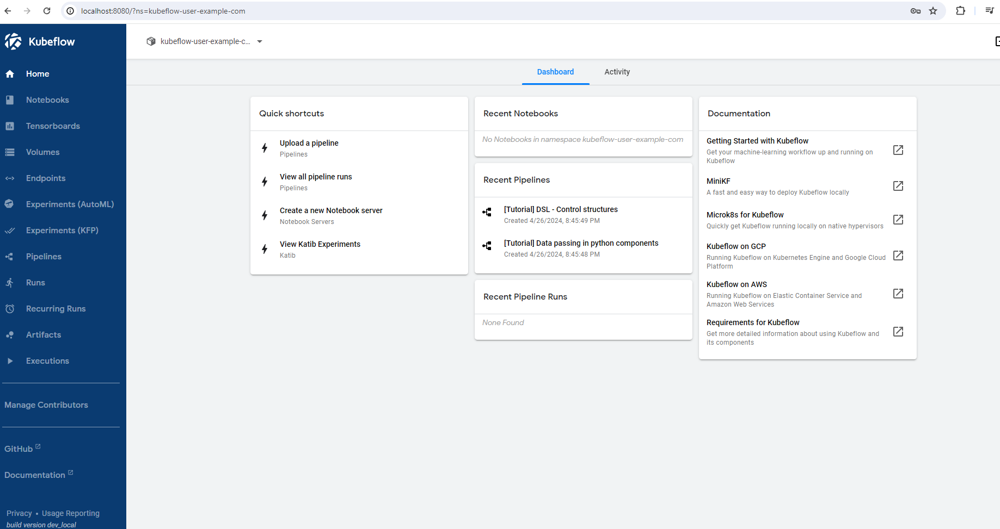
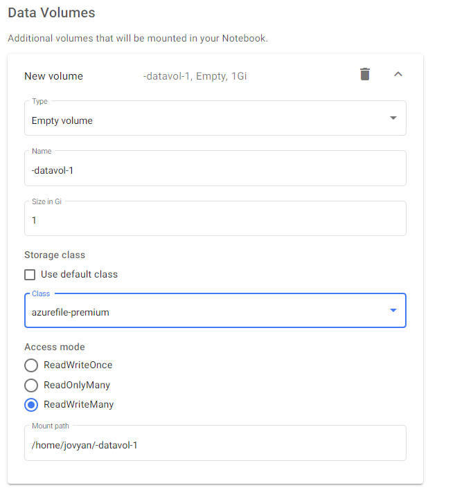
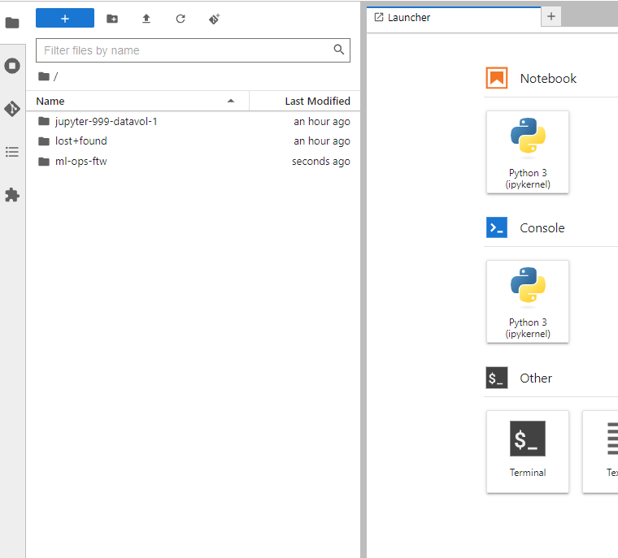
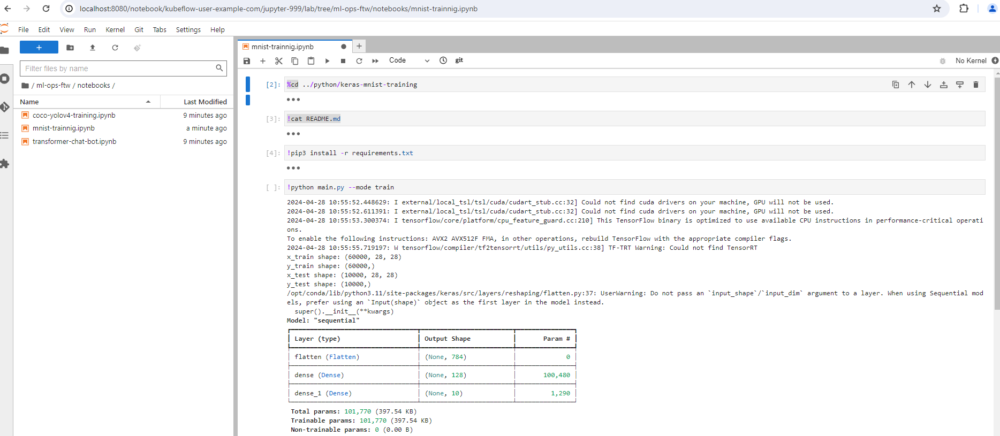

# ml-ops-ftw

## Table of Contents

+ [Summary](#summary)
+ [References](#references)
+ [Features](#features)
+ [Getting started](#getting-started)

## Summary

Repository showcasing ML Ops practices with kubeflow and mlflow

## References

- [MLOps Workflow: Recognizing Digits with Kubeflow](https://github.com/flopach/digits-recognizer-kubeflow/tree/master)
- [Deploy kubeflow into an AKS cluster using default settings](https://azure.github.io/kubeflow-aks/main/docs/deployment-options/vanilla-installation/) 
- [kubeflow - Minimum system requirements](https://deploy-preview-1319--competent-brattain-de2d6d.netlify.app/docs/started/k8s/overview/#minimum-system-requirements)

## Features

- [x] Deployment of Azure Kubernetes Service (AKS) clusters
- [x] kubeflow operator or mlflow helm chart installations in deployed AKS clusters
- [x] CD workflow for on-demand AKS deployments and kubeflow operator or mlflow helm chart installations
- [x] CD wofklow for on demand deployments of an Azure Storage Account Container **(For storing terraform state files)**
- [x] CD workflow for on-demand Azure Container Registry deployments in order to store internal Docker images.
- [ ] CI workflow for building internal docker images and uploading those to an Azure Container Resgitry
- [ ] CD workflows for internal helm chart installations in deployed AKS clusters
- [x] Added `devcontainer.json` with necessary tooling for local development
- [x] Python (pytorch or tensorflow) application for ML training and inference purposes and Jupyter notebooks
    - [x] Simple feedforward neural network with MNIST dataset to map input images to their corresponding digit classes 
    - [x] CNN architecture training and inference considering COCO dataset for image classification AI applications (**NOTE:** Compute and storage intensive. Read `Download the COCO dataset images` comments on preferred hardware specs)
    - [ ] ~~(**OPTIONAL**) Transformer architecture training considering pre-trained models for chatbot AI applications~~
- [x] Dockerizing Python (pytorch or tensorflow) applications for ML training and inference
- [ ] Helm charts with K8s manifests for ML jobs considering the [Training Operator for CRDs](https://github.com/kubeflow/training-operator)
- [ ] Demonstration of model training and model deployment trough automation workflows
- [ ] (**OPTIONAL**) mlflow experiments for the machine learning lifecycle

## Getting started

[Github workflows](./.github/workflows/) will be utilized in this Github repository. Once the workflows described in the **Preconditions** and **Deploy an AKS cluster and install the kubeflow or mlflow components** sections have been successfully executed, all resource groups listed should be visible in the Azure Portal UI:


### Preconditions

0. Deploy an Azure Storage Account Service including container for terraform backends trough the [terraform.yml workflow](https://github.com/MGTheTrain/ml-ops-ftw/actions/workflows/terraform.yml) considering the `INFRASTRUCTURE_OPERATIONS option storage-account-backend-deploy`

### Deploy an AKS cluster and install the kubeflow or mlflow components

0. Deploy an AKS trough the [terraform.yml workflow](https://github.com/MGTheTrain/ml-ops-ftw/actions/workflows/terraform.yml) considering the `INFRASTRUCTURE_OPERATIONS option k8s-service-deploy`. An Azure Container Registry will be part of the deployment in order to store internal Docker images
1. **Optional:** Install ml-ops tools to an existing kubernetes cluster trough [terraform.yml workflow](https://github.com/MGTheTrain/ml-ops-ftw/actions/workflows/terraform.yml) considering the `INFRASTRUCTURE_OPERATIONS option ml-ops-tools-install`

**NOTE:** 
- Set all the required Github secrets for aboves workflows
- In order to locally access the deployed AKS cluster launch the [devcontainer](./.devcontainer/devcontainer.json) and retrieve the necessary kube config as displayed in the GitHub workflow step labeled with title [Download the ~/.kube/config](https://github.com/MGTheTrain/ml-ops-ftw/blob/3f5603fb986f0939be58b8f01b9e0121bde54e3b/.github/workflows/terraform.yml#L82)


### kubeflow

To access the kubeflow dashboard following the installation of kustomize and kubeflow components, execute the following command:

```sh
kubectl get pods -A
kubectl port-forward -n <namespace>  <pod-name> <local-port>:<server-port>
kubectl port-forward svc/istio-ingressgateway -n istio-system 8080:80
```

and visit in a browser of choice `localhost:8080`. 

[Finally, open `http://localhost:8080` and login with the default user’s credentials. The default email address is `user@example.com` and the default password is `12341234`.](https://azure.github.io/kubeflow-aks/main/docs/deployment-options/vanilla-installation/)



#### CNN architecture training considering pre-trained models for image classification AI applications

When creating the Jupyter notebook instance consider the following data volume:



The volumes that were created appear as follows:


The Jypter instace that was created appear as follows:


**NOTE:** You can check the status of the Jupyter instance pods:


Once `CONNECTED` to a Jupyter instance ensure to clone this Git repository (HTTPS URL: `https://github.com/MGTheTrain/ml-ops-ftw.git`):


You then should have the repository cloned in your workspace:



Execute a [Jupyter notebook](./notebooks/) to either train the model or perform inference:



### mlflow

To access the MLflow dashboard following the installation of the MLflow Helm chart, execute the following command:

```sh
kubectl port-forward -n ml-ops-ftw <mlflow pod name> 5000:5000
```

and visit in a browser of choice localhost:5000. 


### Destroy the AKS cluster or uninstall ml tools

0. **Optional:** Uninstall only ml tools of an existing kubernetes cluster trough [terraform.yml workflow](https://github.com/MGTheTrain/ml-ops-ftw/actions/workflows/terraform.yml) considering the `INFRASTRUCTURE_OPERATIONS option ml-ops-tools-uninstall`
1. Destroy an AKS trough the [terraform.yml workflow](https://github.com/MGTheTrain/ml-ops-ftw/actions/workflows/terraform.yml) considering the `INFRASTRUCTURE_OPERATIONS option k8s-service-destroy`